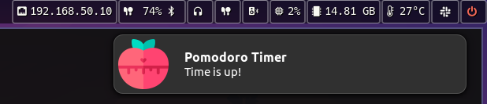

<div align="center">

#  pomodoro-cli
# Pomodoro Timer Command Line Interface

Pomodoro timer is a simple timer that helps you to stay focused on your tasks.

`pomodoro-cli` is a CLI application which implements the basic functionalities of a basic Pomodoro timer. This application was designed to be used with [waybar](https://github.com/Alexays/Waybar).

[](https://www.rust-lang.org/)
[](https://crates.io/crates/pomodoro-cli)
[](LICENSE.md)

</div>

# Installation

### Download binary

- [pomodoro cli (v.1.0.0)](https://github.com/jkallio/pomodoro-cli/releases/tag/v1.0)

### Cargo

```bash
$ cargo install pomodoro-cli
```

# Features

- [x] Start/Stop the Timer
- [x] Query the Timer status
- [x] Add more time to a running timer.
- [x] Triggers system notification when the Timer is finished
- [x] Play alarm sound when the Timer is finished
- [x] Easy Waybar integration
- [x] Customize notification icon
- [x] Customize alarm sound

# Usage

Options for `start`:
- `--duration` Set the duration for the timer (format: `1h 30m 15s`)
- `--notify` Triggers system notification when the timer is finished (default: disabled)
- `--silent` Do not play alarm sound when the timer is finished (default: enabled)

### Start/Stop the timer

```bash
# Start the timer with default configuration
$ pomodoro-cli start

# Start the timer with custom configuration
$ pomodoro-cli start --duration "1h 30m 15s" --silent --notify

# Stop the timer
$ pomodoro-cli stop

# Pause the Timer (calling this command again will resume the timer)
$ pomodoro-cli pause
```

### Query the timer status

```bash
# Get remaining time in seconds (This is the default behavior for `status`)
$ pomodoro-cli status --format seconds

## Get remaining time in human readable format
$ pomodoro-cli status --format human
```

# Customization

## Set custom alarm sound

If you want to use a custom alarm sound, just add a `alarm.mp3` file in the `~/.config/pomodoro-cli` directory.

```bash
$ mkdir -p ~/.config/pomodoro-cli
$ cp /path/to/alarm.mp3 ~/.config/pomodoro-cli/alarm.mp3
```

## Set custom notification icon 



If you want to use a custom notification icon, just add a `icon.png` file in the `~/.config/pomodoro-cli` directory.

```bash
$ mkdir -p ~/.config/pomodoro-cli
$ cp /path/to/icon.png ~/.config/pomodoro-cli/icon.png
```

# Waybar integration

Add the following module to your waybar configuration:


```json
"custom/pomodoro": {
    "format": "   {}",
    "tooltip": false,
    "exec": "pomodoro-cli status --format human",
    "on-click": "pomodoro-cli start --duration 5m",
    "on-click-middle": "pomodoro-cli pause",
    "on-click-right": "pomodoro-cli stop",
    "interval": 1
}
```

If you want to signal Waybar to update the module immediately when you click it, change use the following configuration:

```json
"custom/pomo": {
    "format": "   {}",
    "tooltip": false,
    "exec": "pomodoro-cli status --format human",
    "signal": 10,
    "on-click": "pomodoro-cli start --duration 5m; pkill -SIGRTMIN+10 waybar",
    "on-click-middle": "pomodoro-cli pause; pkill -SIGRTMIN+10 waybar",
    "on-click-right": "pomodoro-cli stop; pkill -SIGRTMIN+10 waybar",
    "interval": 1
}
```

# Alternatives

- [i3-gnome-pomodoro](https://github.com/kantord/i3-gnome-pomodoro)
- [rust-cli-pomodoro](https://crates.io/crates/rust-cli-pomodoro)
- [pomo](https://kevinschoon.github.io/pomo/)
