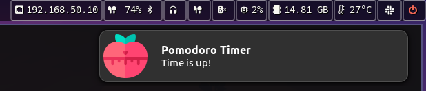

<div align="center">

#  pomodoro-cli
### Pomodoro Timer Command Line Interface

Pomodoro timer is a simple timer that helps you to stay focused on your tasks.

`pomodoro-cli` is a CLI application which implements the basic functionalities of a Pomodoro timer. It integrates well with [waybar](https://github.com/Alexays/Waybar) but works as a standalone timer too.

[](https://www.rust-lang.org/)
[](https://crates.io/crates/pomodoro-cli)
[](LICENSE.md)

</div>

# Installation

### Download binary

- [pomodoro cli (latest release)](https://github.com/jkallio/pomodoro-cli/releases/latest)

### Cargo

```bash
$ cargo install pomodoro-cli
```

# Features

- [x] Start/Stop/Pause the Timer
- [x] Query the Timer status
- [x] Add more time to a running timer.
- [x] Wait for the Timer to finish
- [x] Stream status continuously (one line per second for Waybar integration)
- [x] Add a custom message to the timer status
- [x] Triggers system notification when the Timer is finished
- [x] Play alarm sound when the Timer is finished
- [x] Easy Waybar integration (streaming daemon mode)
- [x] Customize notification icon and alarm sound
- [x] Lock the screen when the timer expires
- [x] Run a configurable Pomodoro cycle with automatic phase advancement
- [x] Repeat a timer or cycle indefinitely


# Usage

Options for `start`:
- `--duration` Set the duration for the timer (format: `1h 30m 15s` or `10:30`)
- `--add` Add more time to a running timer instead of starting a new timer
- `--message` Add a custom message to the timer status
- `--resume` Resume a paused timer (default: disabled)
- `--notify` Triggers system notification when the timer is finished (default: disabled)
- `--silent` Suppress alarm sound when the timer finishes (alarm plays by default)
- `--watch` Stream status continuously for Waybar
- `--wait` Wait for the timer to finish (default: disabled)
- `--lock-screen` Wait for the timer to finish, then lock the screen (default: disabled)
- `--cycle` Run the saved Pomodoro cycle instead of a single timer (conflicts with `--duration`)
- `--repeat` Repeat the previous timer automatically; combined with `--cycle` loops the whole cycle indefinitely

### Start/Stop the timer

```bash
# Start the timer with default configuration (25 min with alarm sound)
$ pomodoro-cli start

# Start a 30 min timer without playing alarm sound, but triggering a system notification
$ pomodoro-cli start --duration "30m" --silent --notify

# Stop the timer
$ pomodoro-cli stop
```

### Pause/Resume the timer

```bash
# Pause the Timer (calling this command again will resume the timer)
$ pomodoro-cli pause

# Resume a paused timer
$ pomodoro-cli start --resume
```

### Add more time to a running timer

```bash
# Add 10 minutes to the timer (instead of starting a new timer)
$ pomodoro-cli start --add 10m
```

### Run a Pomodoro cycle

A cycle is a sequence of named phases (e.g. Work → Break) that advance automatically when each phase finishes.

```bash
# Define a custom cycle (saved to ~/.config/pomodoro-cli/cycle.json)
$ pomodoro-cli set-cycle 'Work:25' 'Short Break:5' 'Work:25' 'Long Break:15'

# Reset the cycle to the built-in default (4×25 min work + short/long breaks)
$ pomodoro-cli set-cycle

# Start the cycle — phases advance automatically on completion
$ pomodoro-cli start --cycle

# Start the cycle and loop it indefinitely when all phases finish
$ pomodoro-cli start --cycle --repeat

# Start the cycle, wait in the foreground, and show a progress bar
$ pomodoro-cli start --cycle --wait
```

The status output shows the current phase name and position while a cycle is active:

```
25:00 [Work 1/4]
```

JSON output gains three extra fields during a cycle:

```json
{ "cycle_phase": "Work", "cycle_index": 1, "cycle_total": 4, ... }
```

### Repeat the previous timer / cycle

`--repeat` keeps a single timer running by automatically restarting it with the same duration each time it expires. If no timer has been run before, the default 25-minute duration is used.

```bash
# Repeat the last timer duration indefinitely (auto-restarts on expiry)
$ pomodoro-cli start --repeat

# Repeat with an explicit duration
$ pomodoro-cli start --duration 30m --repeat

# Repeat the entire cycle
$ pomodoro-cli start --cycle --repeat
```

### Query the timer status

```bash
# Get remaining time in human readable format
$ pomodoro-cli status --format human

# Get the timer status in JSON format (for Waybar integration)
$ pomodoro-cli status --format json

# Specify the timer format in digital format (10:30) -- default
$ pomodoro-cli status --format human --time-format digital

# Specify the time format in segmented format (1h 30m 15s)
$ pomodoro-cli status --format human --time-format segmented

# Specify the time format in seconds
$ pomodoro-cli status --format human --time-format seconds

# Stream status continuously (one line per second) — used for Waybar daemon mode
$ pomodoro-cli status --watch --format json
```

# Waybar integration


Add the following module to your waybar configuration:

```json
"custom/pomo": {
    "format": "   {}",
    "exec": "pomodoro-cli status --watch --format json --time-format digital",
    "return-type": "json",
    "restart-interval": 5,
    "on-click": "pomodoro-cli start --add 5m --notify",
    "on-click-middle": "pomodoro-cli pause",
    "on-click-right": "pomodoro-cli stop"
},
```

Using `--watch` runs a single long-lived process that streams one JSON line per second. Waybar restarts it automatically after `restart-interval` seconds if it ever exits.

### CSS styling

The module supports three different states: `running`, `paused` and `finished`. You can customize the styling of each state by adding the following CSS rules to your Waybar configuration:

```css
#custom-pomo.running {
  background: #304D30;
}

#custom-pomo.paused {
  background: #AB730A;
}

#custom-pomo.finished {
  background: #8F0808;
}
```

###  Update Waybar module immediately

In `--watch` mode, the display updates every second automatically. If you also want the bar to refresh immediately on a button click (e.g. after pausing), add `pkill -SIGRTMIN+10 waybar` to the `on-click` commands and set `"signal": 10`:

```json
"custom/pomo": {
    "exec": "pomodoro-cli status --watch --format json --time-format digital",
    "restart-interval": 5,
    "signal": 10,
    "on-click": "pomodoro-cli start --add 5m --notify; pkill -SIGRTMIN+10 waybar",
    "on-click-middle": "pomodoro-cli pause; pkill -SIGRTMIN+10 waybar",
    "on-click-right": "pomodoro-cli stop; pkill -SIGRTMIN+10 waybar"
}
```

# Customization

Custom files are loaded from `~/.config/pomodoro-cli/`. Create the directory once if it doesn't exist. The `set-cycle` command stores its cycle definition there as `cycle.json`.

```bash
$ mkdir -p ~/.config/pomodoro-cli
```

## Set custom alarm sound

Place an `alarm.mp3` file in the configuration directory:

```bash
$ cp /path/to/alarm.mp3 ~/.config/pomodoro-cli/alarm.mp3
```

## Set custom notification icon



Place an `icon.png` file in the configuration directory:

```bash
$ cp /path/to/icon.png ~/.config/pomodoro-cli/icon.png
```

# Development Requirements

- libasound2 development files
    - `apt-get install libasound2-dev` on Debian derivatives
    - `dnf install alsa-lib-devel` on Fedora

# Alternatives

- [i3-gnome-pomodoro](https://github.com/kantord/i3-gnome-pomodoro)
- [openpomodoro-cli](https://github.com/open-pomodoro/openpomodoro-cli)
- [rust-cli-pomodoro](https://crates.io/crates/rust-cli-pomodoro)
- [pomo](https://kevinschoon.github.io/pomo/)
